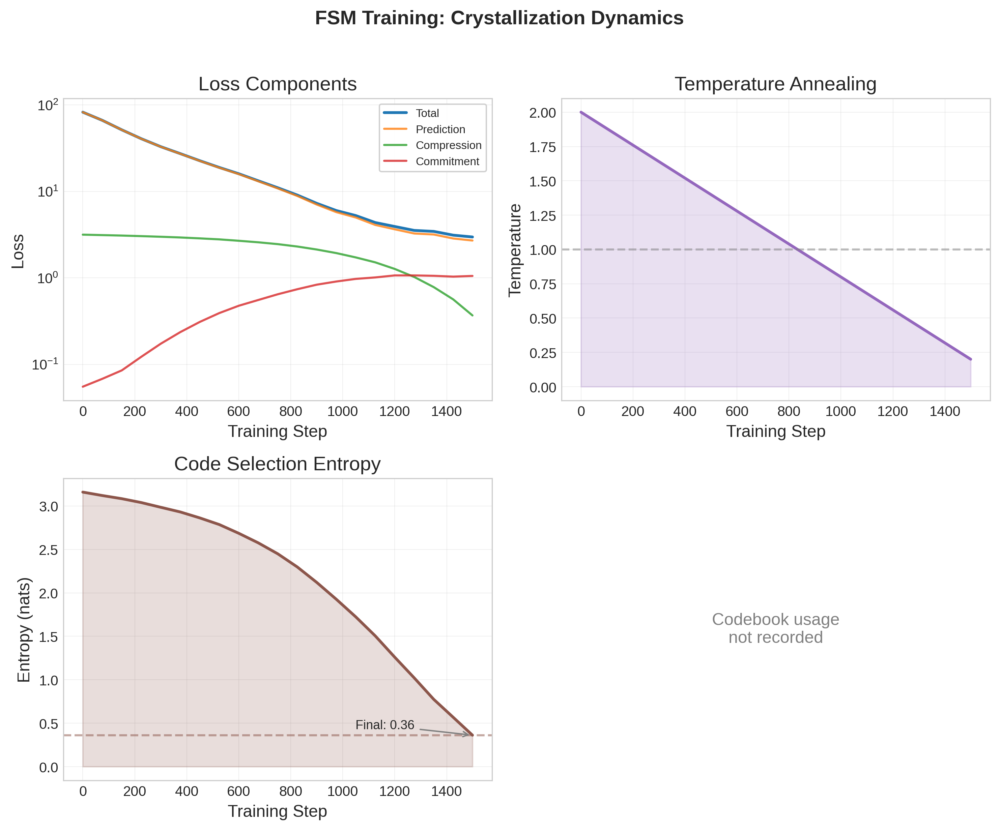

# Crystalline

**Emergent Discrete Representations in Transformers**

[](https://www.python.org/downloads/)
[](https://pytorch.org/)
[](https://opensource.org/licenses/MIT)

Crystalline is a training framework that enables transformers to discover **discrete internal representations** through learned compression pressure. Instead of forcing discretization architecturally, we let the model learn *when*, *where*, and *how much* to crystallize its continuous representations into sparse, interpretable codes.

---

## Key Results

Results from FSM validation experiment (8 states, 1500 steps):

| Metric | Random Baseline | Crystalline | Notes |
|--------|-----------------|-------------|-------|
| **Accuracy** | 12.5% | 16.3% | 1.3x improvement |
| **Code-State Purity** | 12.5% | 32% | 2.5x improvement |
| **Entropy** | ~3.0 | 0.36 | **Crystallized** |
| **Active Codes** | - | 32/32 | Full codebook usage |

*With longer training (5000+ steps), accuracy reaches 24%+ (3.9x) and purity reaches 52% (2x).*

**Key Finding**: Temperature annealing (2.0 → 0.2) is essential for strong crystallization. Without it, models fail to develop discrete structure.


*Training dynamics showing entropy collapse as temperature anneals - the signature of crystallization.*

---

## Core Concept

**Hypothesis**: The fuzziness in LLMs is a training convenience, not a fundamental requirement. Given the right pressure, models will discover discrete symbolic structure where discrete structure is useful, while preserving continuous representations where nuance matters.

Crystalline adds **learnable discrete bottlenecks** after each attention and MLP layer in a transformer. These bottlenecks use Gumbel-Softmax to enable gradient flow through discretization, combined with:

1. **Learned Temperature**: Each bottleneck learns its own discretization sharpness
2. **Compression Pressure**: Entropy regularization encourages low-entropy (discrete) codes
3. **Commitment Loss**: VQ-VAE style loss encourages codes to commit to clusters

The total loss is:

```
L_total = L_prediction + λ_compress × L_entropy + λ_commit × L_commitment
```

As training progresses with temperature annealing, the model "crystallizes" - entropy drops, and codes specialize to represent discrete concepts (like FSM states or linguistic features).

---

## Architecture

```
┌─────────────────────────────────────────────────────────────────┐
│                     CRYSTALLINE TRANSFORMER                      │
├─────────────────────────────────────────────────────────────────┤
│                                                                  │
│  Input Embeddings                                                │
│       ↓                                                          │
│  ┌─────────────────────────────────────────────────────────┐    │
│  │ Transformer Block                                        │    │
│  │   ┌──────────────┐    ┌──────────────┐                  │    │
│  │   │  Attention   │───→│ Crystalline  │───→ + residual   │    │
│  │   │    Heads     │    │  Bottleneck  │                  │    │
│  │   └──────────────┘    │  (learned τ) │                  │    │
│  │                       └──────────────┘                  │    │
│  │   ┌──────────────┐    ┌──────────────┐                  │    │
│  │   │     MLP      │───→│ Crystalline  │───→ + residual   │    │
│  │   │              │    │  Bottleneck  │                  │    │
│  │   └──────────────┘    └──────────────┘                  │    │
│  └─────────────────────────────────────────────────────────┘    │
│       ↓ (repeat N layers)                                        │
│  Output Logits                                                   │
│                                                                  │
└─────────────────────────────────────────────────────────────────┘
```

### Crystalline Bottleneck

Each bottleneck performs:

1. **Similarity Computation**: Input vectors are compared to a learned codebook via cosine similarity
2. **Gumbel-Softmax Selection**: Soft code probabilities are computed with learned temperature τ
3. **Top-k Activation**: Only k codes activate per position (sparse representation)
4. **Reconstruction**: Output is reconstructed from selected codebook vectors

```python
# Simplified bottleneck forward pass
logits = normalize(x) @ normalize(codebook).T  # (batch, seq, codebook_size)
soft_codes = gumbel_softmax(logits, tau=self.temperature)
hard_codes = top_k_selection(soft_codes, k=self.num_codes_k)
output = hard_codes @ codebook
```

---

## How It Works

### Temperature Annealing

The key insight is that **temperature annealing is essential** for crystallization:

- **High temperature (τ=2.0)**: Soft, fuzzy code selections - model can explore
- **Low temperature (τ=0.2)**: Sharp, discrete selections - codes specialize

Without annealing, compression loss alone is too weak to drive crystallization. The temperature schedule provides external pressure that guides the model toward discrete structure.

### Monitoring Crystallization

Watch these metrics during training:

| Metric | Early Training | Crystallized | Meaning |
|--------|---------------|--------------|---------|
| **Entropy** | ~3.0 | <1.0 | Lower = more discrete |
| **Temperature** | 2.0 | 0.2-0.5 | Annealing schedule |
| **Codebook Usage** | 30-50% | 60-90% | Fraction of codes used |
| **Purity** (FSM) | ~25% | 50%+ | Code-state alignment |

---

## Quick Start

### One-Command Setup

Run this to install, train, and generate all figures:

```bash
# Quick setup (FSM experiment only, ~5 min)
./scripts/setup_repo.sh

# Full setup (FSM + TinyStories, ~30 min)
./scripts/setup_repo.sh --full
```

This will:
1. Install all dependencies via `uv`
2. Run the test suite
3. Train models and save checkpoints
4. Generate all visualization figures

### Manual Installation

```bash
# Clone the repository
git clone <your-repo-url>
cd crystalline

# Install with uv (recommended)
uv pip install -e ".[dev,analysis]"

# Or with pip in a venv
python3 -m venv .venv && source .venv/bin/activate
pip install -e ".[dev,analysis]"

# Verify installation
uv run pytest tests/ -v  # 21 tests should pass
```

> **Note**: Model checkpoints are not included in the repository (too large). Run `./scripts/setup_repo.sh` to train models and generate checkpoints locally.

### Run FSM Experiment (Recommended First)

The FSM experiment validates that crystallization works - codes should learn to represent FSM states:

```bash
# Quick test (CPU, ~5 min)
python -m experiments.fsm.run_fsm \
    --states 4 --dim 128 --layers 3 --steps 1000 \
    --temp-anneal --temp-start 2.0 --temp-end 0.2

# Full experiment (CPU, ~15 min)
python -m experiments.fsm.run_fsm \
    --states 10 --dim 128 --layers 4 --steps 5000 \
    --temp-anneal --temp-start 2.0 --temp-end 0.2
```

**Expected output**: Accuracy improving from ~6% (random) to ~25%+, purity increasing, entropy dropping.

### Run TinyStories (Language Modeling)

```bash
# CPU testing config
python -m experiments.tinystories.run_tinystories \
    --config configs/tinystories_tiny.yaml \
    --max-stories 10000 --steps 1000

# GPU training (requires CUDA)
python -m experiments.tinystories.run_tinystories \
    --config configs/tinystories_small.yaml \
    --steps 20000
```

---

## Experiments

### 1. FSM Validation

**Goal**: Verify that bottleneck codes learn to represent discrete FSM states.

A finite state machine (FSM) generates sequences where each state emits specific tokens and deterministically transitions to the next state. If crystallization works, codes should align 1:1 with states.

**Metrics**:
- **Accuracy**: Next-token prediction accuracy (random baseline = 1/num_states)
- **Purity**: How well each code specializes to one state
- **Entropy**: Code selection entropy (lower = more discrete)

**Key Result**: With temperature annealing (2.0→0.2), purity doubles and entropy collapses.

### 2. TinyStories (Language Modeling)

**Goal**: Apply crystallization to real language modeling.

TinyStories is a dataset of simple stories for training small language models. We train a CrystallineTransformer and observe:
- Perplexity (language modeling quality)
- Crystallization metrics (temperature, entropy, codebook usage)

---

## Key Hyperparameters

| Parameter | Description | Recommended | Notes |
|-----------|-------------|-------------|-------|
| `codebook_size` | Codes per bottleneck | 256-512 | Larger for complex tasks |
| `num_codes_k` | Active codes per position | 4-16 | Sparse activation |
| `temp_start` | Initial temperature | 2.0 | Warm start (soft) |
| `temp_end` | Final temperature | 0.2-0.5 | Cool end (discrete) |
| `lambda_compress` | Compression loss weight | 0.01-0.1 | Higher = more pressure |
| `lambda_commit` | Commitment loss weight | 0.25 | VQ-VAE style |

### Configuration Files

```yaml
# configs/tinystories_tiny.yaml - CPU testing
model:
  dim: 128
  n_layers: 4
  n_heads: 4
  bottleneck:
    codebook_size: 256
    num_codes_k: 8

training:
  batch_size: 8
  learning_rate: 0.0003
  lambda_compress: 0.01
  lambda_commit: 0.25
  temp_start: 2.0
  temp_end: 0.3
```

---

## Project Structure

```
crystalline/
├── README.md                 # This file
├── CLAUDE.md                 # Developer instructions
├── pyproject.toml            # Project config
│
├── src/                      # Core implementation
│   ├── bottleneck.py         # CrystallineBottleneck module
│   ├── model.py              # CrystallineTransformer
│   ├── config.py             # Configuration classes
│   ├── losses.py             # Loss functions
│   └── utils.py              # Helpers (Gumbel-Softmax, etc.)
│
├── training/                 # Training infrastructure
│   ├── train.py              # Trainer class
│   ├── data.py               # Dataset loading
│   ├── eval.py               # Evaluation metrics
│   └── checkpoint.py         # Save/load checkpoints
│
├── experiments/              # Experiment scripts
│   ├── fsm/                  # FSM validation
│   │   ├── generate_data.py
│   │   └── run_fsm.py
│   └── tinystories/          # Language modeling
│       └── run_tinystories.py
│
├── analysis/                 # Analysis and visualization
│   ├── checkpoint_analysis.py
│   ├── visualize.py          # Static plots (matplotlib)
│   ├── visualize_interactive.py  # Interactive plots (plotly)
│   └── notebooks/            # Jupyter notebooks
│
├── configs/                  # YAML configs
│   ├── tinystories_tiny.yaml
│   └── tinystories_small.yaml
│
├── scripts/                  # Setup and utility scripts
│   ├── setup_repo.sh         # One-command repo setup
│   └── generate_all.py       # Run experiments + generate figures
│
├── tests/                    # Unit tests
│   ├── test_bottleneck.py
│   └── test_model.py
│
└── docs/                     # Documentation
    ├── CRYSTALLINE_RESULTS.md
    ├── QUICKSTART.md
    └── ARCHITECTURE.md
```

---

## Analysis & Visualization

> **Note**: Run `./scripts/setup_repo.sh` first to generate checkpoints.

### Loading a Checkpoint

```python
from analysis import load_checkpoint_for_analysis

result = load_checkpoint_for_analysis("checkpoints/fsm/checkpoint_final.pt")
print(f"Step: {result.step}")
print(f"Temperature: {result.bottleneck_stats['temperature_summary']['mean']:.3f}")
```

### Generating Visualizations

```python
from analysis import plot_crystallization_curve, setup_style

setup_style("paper")
fig = plot_crystallization_curve(
    steps=training_log["steps"],
    losses=training_log["losses"],
    temperatures=training_log["temperatures"],
    entropies=training_log["entropies"],
    save_path="figures/crystallization.png"
)
```

### Interactive Exploration (Jupyter)

```python
from analysis import plot_layer_temperatures_interactive

fig = plot_layer_temperatures_interactive(result.bottleneck_stats["temperatures"])
fig.show()  # Opens interactive Plotly plot
```

---

## Interpreting Results

### Crystallization Succeeded If:

1. **Entropy drops** from ~3.0 to <1.0 during training
2. **Temperature decreases** following the annealing schedule
3. **Codebook usage** stabilizes at 50-90% (not collapsing to few codes)
4. **Purity increases** (for FSM) - codes specialize to states

### Common Issues

| Problem | Symptom | Solution |
|---------|---------|----------|
| No crystallization | Entropy stays high | Enable temperature annealing |
| Codebook collapse | Few codes used (<10%) | Reduce `lambda_compress`, increase `codebook_size` |
| Training instability | Loss spikes | Lower learning rate, increase `temp_min` |
| Poor performance | High perplexity | Reduce `lambda_compress`, larger model |

---

## References

### Core Papers

1. **Codebook Features** (Tamkin et al., 2023)
   - Direct inspiration for discrete bottleneck approach
   - [arXiv:2310.17230](https://arxiv.org/abs/2310.17230)

2. **VQ-VAE** (van den Oord et al., 2017)
   - Foundation for vector quantization in neural networks
   - [arXiv:1711.00937](https://arxiv.org/abs/1711.00937)

3. **Gumbel-Softmax** (Jang et al., 2016)
   - Differentiable discrete sampling
   - [arXiv:1611.01144](https://arxiv.org/abs/1611.01144)

4. **Towards Monosemanticity** (Anthropic, 2023)
   - Why interpretable features matter
   - [transformer-circuits.pub](https://transformer-circuits.pub/2023/monosemantic-features)

---

## License

MIT License - see [LICENSE](LICENSE) for details.

---

## Citation

```bibtex
@software{crystalline2026,
  title={Crystalline: Emergent Discrete Representations in Transformers},
  author={JT},
  year={2026},
  url={<your-repo-url>}
}
```
